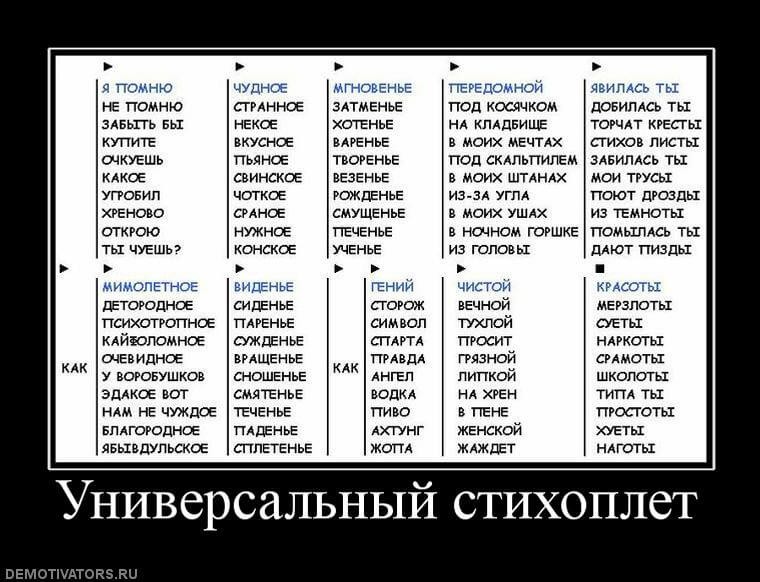

# Универсальный Поэт-Стихоплёт As A Service

Text below is in Russian. For non-russian readers - this project is just an illustration of node.js/express development.
I generates random poem, using a skeletone.
Can be accessed via http GET request and returns data via HTML response (can be embedded somwhere, for example) or JSON response.

Этот проект является является исключительно иллюстрацией к демотиватору, найденному в сети:

## Зачем ?

Просто проиллюстрировать пример, что создание веб-приложений с помощью node.js и express - дело быстрое и простое.

## Установка 

* `git clone https://github.com/znoxx/OopsaaS`
* `cd oopsaas`
* `npm install`
* `PORT=DESIRED_PORT_NUMBER_FOR_EXAMPLE_3000 npm start`

## API
### HTML response
`GET http://your_ip:your_port/`

Возвращает HTML-страничку, годную для встраивания например в iFrame

### JSON response
`GET http://your_ip:your_port/json`

Возвращает JSON-массив из 4х строк

### Have Fun